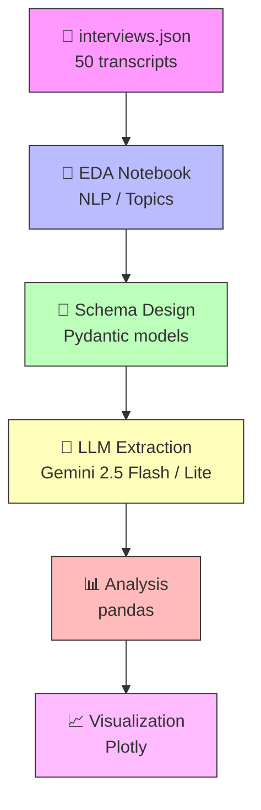

## Executive Summary

This project analyzes 50 synthetic interview transcripts from inflammatory bowel disease (IBD) patients using an LLM-powered extraction pipeline to answer four critical research questions:

1. **What is the current rate of biologic adoption among IBD patients?**
2. **What barriers prevent patients from accessing biologic therapy?**
3. **What treatment patterns exist before patients reach biologics?**
4. **How do patients navigate the healthcare system from initial symptoms to established care?**

**The central finding is that cost and insurance — not clinical resistance — is the dominant barrier preventing biologic adoption.** Among the 32% of patients not currently on a biologic, 69% cite cost or insurance obstacles. This represents an addressable market gap:

> Patients and their physicians *want* biologics, but the system makes access difficult.

However, these numbers come with important caveats. Our dataset contains incomplete patient journeys that likely bias results, and the small sample size limits generalizability. This analysis demonstrates how an AI engineering pipeline can extract structured insights from unstructured clinical narratives while transparently accounting for data quality limitations.

### Key Findings

- **68% of patients are currently on a biologic**, but churn bias suggests the true population rate is lower (55–65%)
- **Cost and insurance (69%) is the dominant barrier** to biologic adoption — not clinical resistance
- **Median 3 treatment steps** before first biologic, following a consistent ladder: mesalamine → prednisone → immunomodulators → biologics
- **70% of patients were initially misdiagnosed** — most commonly as IBS or stress-related — navigating a median of 4 provider steps to established care

## The Story the Data Tells

### The Treatment Ladder Is Working... Until It Hits a Wall

The data reveals a clear, consistent treatment escalation pattern across patients:

**Mesalamine → Prednisone → Azathioprine/Methotrexate → Biologics**

Patients try a median of **3 medications** before reaching their first biologic (range: 0–6). The step-up approach is clinically sound — aminosalicylates (found in 64% of pre-biologic regimens), corticosteroids (52%), and immunomodulators (68%) all serve their role in the ladder.

<iframe src="/assets/projects/ai-patient-journey/q3_steps_to_biologic.html"
        width="100%" height="500" frameborder="0" style="border: 1px solid #e1e4e8; border-radius: 6px;">
</iframe>

But the ladder has a broken rung. When patients reach biologics, many hit a wall that isn't clinical — it's financial and administrative. Insurance companies enforce "step therapy" requirements, demanding patients fail on cheaper medications before approving biologics, even when physicians believe earlier biologic intervention is warranted.

This isn't just bureaucratic friction: it's measurable delay in effective treatment for a progressive, tissue-damaging disease.

### Who Is on Biologics, and Who Isn't?

**68% (34/50) of patients appear to be on a biologic**, but this snapshot understates the progression story. The funnel provides clearer context: nearly every patient has had biologics discussed, and engagement narrows predictably at each stage.

**90% discussed → 72% ever used → 68% currently on**

The 4% gap between "ever used" and "currently on" represents two patients who discontinued — a small but strategically important segment. More importantly, *the gap between discussion and adoption isn't driven by ignorance — it's driven by access*.

<iframe src="/assets/projects/ai-patient-journey/q1_biologic_adoption.html"
        width="100%" height="500" frameborder="0" style="border: 1px solid #e1e4e8; border-radius: 6px;">
</iframe>

Adoption also increases with disease duration, consistent with step-up therapy dynamics. Patients diagnosed less than one year ago show lower current biologic use not because of resistance, but because they have not yet progressed through conventional lines of therapy — positioning them as future biologic candidates rather than permanent non-adopters.

Among the 34 patients on biologics, **Humira (adalimumab)** dominates with 25 mentions, followed by Remicade (infliximab) at 18 and Stelara (ustekinumab) at 12. This aligns with Humira's first-mover advantage and subcutaneous convenience, though Remicade's strong showing reflects its continued role for severe or refractory cases.

### The Barrier Landscape: Distinct Patient Archetypes

The 16 patients not on biologics aren't a monolith. They fall into distinct archetypes, each requiring a different intervention according to the biologic barriers they face.

<iframe src="/assets/projects/ai-patient-journey/q2_biologic_barriers.html"
        width="100%" height="500" frameborder="0" style="border: 1px solid #e1e4e8; border-radius: 6px;">
</iframe>

**1. The Insurance-Blocked Patient (69%)**
The largest group. These patients have physicians who want to prescribe biologics, but insurance denies coverage or demands step therapy failures first. Some face catastrophic out-of-pocket costs.

**2. The Fear-Driven Patient (62%)**
Patients who are medically eligible but terrified of side effects — cancer risk, serious infections, immunosuppression. Often amplified by online research.

**3. The Doctor-Deferred Patient (25%)**
Physicians who are hesitant to escalate, preferring to exhaust conventional options first — sometimes beyond what guidelines recommend.

**4. The Preference-Driven Patient (19%)**
Patients who prefer to explore non-biologic options, whether due to personal beliefs, desire for autonomy, or reluctance to commit to long-term injectable therapy.

The critical insight is that **cost/insurance co-occurs with nearly every other barrier.** A patient might fear side effects and face insurance denials and have a hesitant doctor. Solving any single barrier in isolation won't move the needle — interventions need to address the *cluster*.

<iframe src="/assets/projects/ai-patient-journey/q2_barrier_cooccurrence.html"
        width="100%" height="500" frameborder="0" style="border: 1px solid #e1e4e8; border-radius: 6px;">
</iframe>

### The Referral Maze: 70% Are Initially Misdiagnosed

Perhaps the most striking finding is the referral pathway data. Patients navigate a median of **4 provider steps** from first symptoms to established care (range: 2–12). The dominant path is:

**GP/Primary Care → Gastroenterologist → Specialist(s) → Mental Health**

But 70% of patients (35/50) were initially misdiagnosed — most commonly as **IBS** or told their symptoms were **stress-related**. This misdiagnosis introduces significant diagnostic delay, during which disease progression continues unchecked.

<iframe src="/assets/projects/ai-patient-journey/q4_misdiagnosis_impact.html"
        width="100%" height="500" frameborder="0" style="border: 1px solid #e1e4e8; border-radius: 6px;">
</iframe>

The Sankey diagram shows the branching complexity: patients bounce between GPs, ERs, multiple GI specialists, surgeons, and mental health providers before their care stabilizes. The *real* market access challenge may begin years before the biologic conversation — at the point of initial misdiagnosis.

## Data Limitations & Churn Bias

### The Churn Problem

Of 50 transcripts, 44 are classified as "complete" interviews (completeness score ≥ 0.75) and 6 are "partial" (lower completeness scores). The partial transcripts correspond to shorter interviews with less treatment history.

The critical question: **does patient incompleteness correlate with biologic adoption?**

| Group | n | On Biologic | Adoption Rate |
|---|---|---|---|
| Complete interviews | 44 | 32 | **72%** |
| Partial interviews | 6 | 2 | **33%** |
| **Overall** | **50** | **34** | **68%** |

The difference is stark: 72% vs 33%. This means our headline 68% adoption rate is likely an **overestimate** of the true population rate and thus to be taken as an *upper-bound* estimate, because patients with more complete records are more likely to be on biologics.

<iframe src="/assets/projects/ai-patient-journey/churn_bias_scatter.html"
        width="100%" height="500" frameborder="0" style="border: 1px solid #e1e4e8; border-radius: 6px;">
</iframe>

### Why This Matters

If incomplete interviews represent patients who disengaged from the healthcare system, then the "real" untreated population is larger than our 32% estimate suggests. The patients we *can't* fully see in the data — those who dropped out before reaching a biologic conversation — may represent the highest-need, hardest-to-reach segment.

**The direction of bias is important:** it makes the addressable opportunity look *smaller* than it actually is. *The true population eligible for biologic outreach is likely larger than 32%*.

### Communicating Uncertainty

We recommend interpreting these results as **directional signals, not precise measurements:**

- The **68% biologic adoption rate is a reasonable estimate** for patients *engaged enough to complete an interview*. The true population rate is likely lower.
- **Cost/insurance being the #1 barrier is a high-confidence finding** — it appears across both complete and partial interviews, is corroborated by entity extraction, and aligns with published literature on biologic access.
- **The treatment ladder** (median 3 steps to biologic) **is robust** because it's derived from ordered sequences within individual transcripts, not cross-patient comparisons.
- The **70% misdiagnosis** rate should be treated as **directionally correct** *but potentially inflated* — patients in interviews may over-report negative experiences.

## Technical Implementation

### Pipeline Architecture

The extraction pipeline transforms unstructured transcripts into structured records through a multi-stage AI engineering workflow. I designed the system around three core principles: **structured extraction with confidence scoring**, **churn detection as a first-class concept**, and **async processing with rate limit management**.



| Component | Technology | Purpose |
|---|---|---|
| Schema | Pydantic v2 | 13 enums, 8 nested models, confidence scores on every field |
| Extraction | instructor + litellm | Structured LLM output with chain-of-thought prompting |
| LLM | Gemini 2.5 Flash / Flash Lite | Free-tier models with round-robin rotation |
| Analysis | pandas + Python | Research question analysis with churn-adjusted metrics |
| Visualization | Plotly | Interactive charts with hover, zoom, pan |
| EDA | scikit-learn, wordcloud, VADER | Topic modeling (LDA/NMF), TF-IDF, entity extraction |
| Testing | pytest | 16 unit tests covering schema, data loading, analysis |

### Key Design Decisions

**1. Chain-of-thought extraction:** The LLM is prompted to first *identify* relevant information by category, then *structure* it into the Pydantic schema. This two-step approach improves accuracy on complex temporal reasoning (treatment order, referral sequences).

**2. Confidence scoring:** Every extracted field carries a confidence level (HIGH / MEDIUM / LOW / NOT_FOUND). This lets downstream analysis weight findings appropriately and distinguishes "patient is not on biologic" from "we don't know if patient is on biologic."

::: {.column-margin}
Confidence scoring is critical for healthcare analytics where missing data vs. negative findings have different clinical implications.
:::

**3. Churn as a first-class concept:** The `DataCompleteness` model explicitly tracks completeness scores, churn indicators, and missing information — enabling the bias analysis that became central to interpreting results.

**4. Async extraction with model rotation:** The pipeline uses `asyncio` with semaphore-based concurrency, rotating requests across multiple Gemini models to maximize free-tier throughput (~3× faster than sequential). This was essential for processing 50 transcripts without hitting rate limits.

::: {.column-margin}
```python
# Simplified async pattern
async with asyncio.Semaphore(5):
    tasks = [extract(t, model)
             for t, model in
             zip(transcripts, cycle(models))]
    results = await asyncio.gather(*tasks)
```
:::

### Schema Design

The Pydantic schema captures the full complexity of each patient record — demographics, diagnosis, treatment sequences, biologic status with barriers, referral pathways, and data completeness with churn indicators.

```python
# Core schema structure (simplified for readability)
class PatientRecord(BaseModel):
    patient_id: str
    demographics: Demographics           # age, gender, occupation, comorbidities
    diagnosis_status: DiagnosisStatus     # confirmed, misdiagnosed, unknown
    treatments: list[Treatment]           # ordered sequence with type, outcome, confidence
    biologic_status: BiologicStatus       # current use, barriers, barrier details
    referral_pathway: list[ReferralStep]  # provider type, action taken, wait time
    emotional_themes: list[str]
    data_completeness: DataCompleteness   # completeness score, churn indicator
```

This schema evolved through exploratory data analysis. Before building the extraction pipeline, I performed classical NLP analysis (TF-IDF, topic modeling with LDA/NMF, sentiment analysis with VADER, regex-based entity extraction) to understand corpus structure and identify the key information dimensions that needed capture. The 5 dominant themes that emerged — medication management, healthcare navigation, family burden, mental health, and chronic illness complications — directly informed the schema design.

### Data Quality Assessment

Before analyzing the four research questions, I built a completeness scoring system to detect potential survivorship bias. Each record receives a completeness score based on how many schema fields contain high-confidence data vs. missing values.

<iframe src="/assets/projects/ai-patient-journey/data_quality_completeness.html"
        width="100%" height="500" frameborder="0" style="border: 1px solid #e1e4e8; border-radius: 6px;">
</iframe>

The completeness distribution revealed that 6/50 records clustered in the low-completeness, low-treatment corner — the early warning signal that led to the churn bias analysis. This is where AI engineering meets research rigor: the pipeline didn't just extract data, it *quantified extraction quality* and surfaced potential biases before results were interpreted.

## Treatment Landscape Deep Dive

To understand pre-biologic treatment patterns, I extracted medication sequences and classified drugs by therapeutic class using regex patterns matched against clinical terminology:

```python
MEDICATIONS = {
    "aminosalicylates": ["mesalamine", "sulfasalazine", "asacol", ...],
    "corticosteroids": ["prednisone", "budesonide", "prednisolone", ...],
    "immunomodulators": ["methotrexate", "azathioprine", "6-mp", ...],
    "biologics": ["humira", "remicade", "stelara", "entyvio", ...],
}
```

This baseline extraction served dual purposes: (1) validation benchmark for LLM accuracy, and (2) treatment ladder analysis independent of LLM interpretation. The consistency between regex counts and LLM-extracted sequences gave confidence in the treatment ordering.

<iframe src="/assets/projects/ai-patient-journey/q3_treatment_landscape.html"
        width="100%" height="500" frameborder="0" style="border: 1px solid #e1e4e8; border-radius: 6px;">
</iframe>

The ladder analysis shows aminosalicylates (64%), corticosteroids (52%), and immunomodulators (68%) forming the expected step-up progression. What makes this analysis engineering-focused rather than just descriptive: the extraction pipeline preserved *temporal order* within each patient's treatment sequence, enabling ladder reconstruction that respects individual patient journeys rather than aggregating across population.

## Evidence Summary & Confidence Assessment

| Question | Finding | Confidence | Key Caveat |
|---|---|---|---|
| Biologic adoption | 68% currently on biologic | **Medium-High** | Upper-bound estimate; churn bias means true rate is likely lower (55–65%) |
| Main barriers | Cost/insurance (69%), fear (62%), doctor hesitancy (25%) | **High** | Corroborated across extraction + regex + topic modeling; robust to churn |
| Treatment ladder | Median 3 steps; aminosalicylates → corticosteroids → immunomodulators → biologic | **High** | Based on narrative order, not verified clinical records |
| Referral pathway | 70% misdiagnosed; median 4 provider steps | **Medium** | May be inflated by recall bias in interview setting |

## Conclusion

This project demonstrates an end-to-end GenAI pipeline for extracting structured clinical intelligence from unstructured patient narratives. The combination of classical NLP for exploration, LLM-powered extraction for structured output, confidence scoring, churn detection, and survivorship bias analysis provides a methodological template for healthcare text analytics at scale.

The most actionable finding is clear: **cost and insurance barriers, not clinical resistance, gate biologic access.** This finding is high-confidence, corroborated across multiple extraction methods, and robust to the churn bias present in our data. The 70% misdiagnosis rate and median 4-step referral pathway suggest that market access challenges begin years before the biologic conversation — at the point of initial misdiagnosis.

From an AI engineering perspective, the key contributions are:

- **Structured extraction with validation**: Pydantic schemas + confidence scoring + baseline regex comparison
- **Bias quantification**: Churn detection and completeness scoring as first-class pipeline outputs
- **Async optimization**: Model rotation and semaphore-based concurrency for free-tier LLM throughput
- **Transparent uncertainty**: Every finding presented with confidence levels and methodological caveats

The pipeline's design decisions are transferable to any domain where unstructured text needs to become structured, analyzable data — particularly in healthcare, legal, or customer research contexts where data quality and bias detection are as important as the insights themselves.
